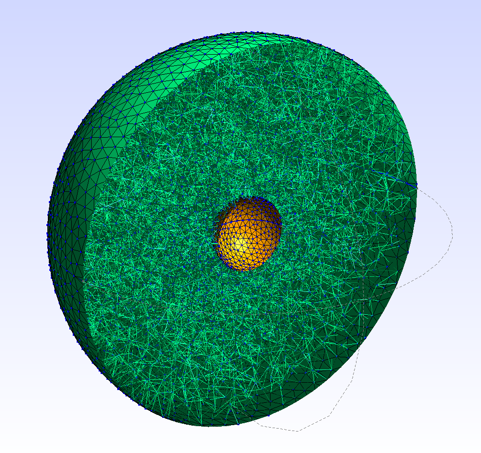
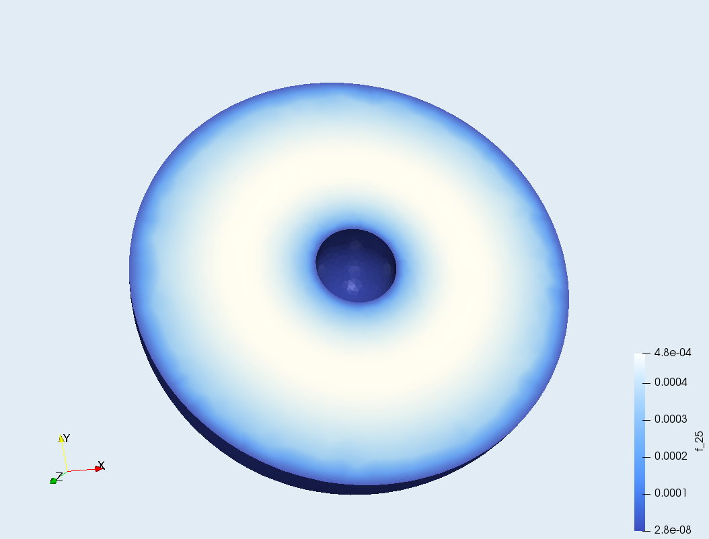

# chameleon_sim
3D finite element analysis of Chameleon field

codes & documentations both under development

------------------------------------------
### Quick Learning resources

- [Fenics Project](https://fenicsproject.org/)<br>
This project 100% relies on this pde solver core package.

- [Fenics Tutorial](https://fenicsproject.org/pub/tutorial/html/ftut1.html)<br>
Not the quickest way to learn, but very long and in-depth tutorial with lots of information.

- [Fenics 2D Linear Poisson example](https://fenicsproject.org/docs/dolfin/1.6.0/python/demo/documented/poisson/python/documentation.html)<br>
Note that there are multiple versions of documentations available online. Currently Dolfin (interface module for Fenics) 1.6.0 is the newest version in March 2020. The version of the documentation can be checked with the version number printed on the left-top corner.

- [Blog article about Electrostatic sim with Fenics](https://comphysblog.wordpress.com/2018/08/26/3d-electrostatics-using-fenics/)<br>
Best blog article for the beginner of Fenics 3D simulation. I initially built a copy of this sample code, and modified parts by parts to learn how it works.

- [Fenics online forum](https://fenicsproject.discourse.group/)<br>
Very active. Quickest way to get your question answered as long as you follow the rule.

- [Variational Formulation of elliptic PDEs](https://www.ljll.math.upmc.fr/ledret/M1English/M1ApproxPDE_Chapter3.pdf)<br>
Technical, but good for learning. Just reading the first few pages is a good way to start learning about this technique.

-----------------------------

### References

- [Chameleon Dark Energy and Atom Interferometry (Elder et al. 2016)](https://arxiv.org/abs/1603.06587)
- [Atom-interferometry constraints on dark energy
 (Hamilton et al. 2015)](https://arxiv.org/abs/1502.03888)

 --------------------------------

 ## (I) PDE solver core: Fenics

Fenics is an open-source pde solver mainly developed for the finite element analysis. It runs c++ code wrapped by python package. The documentation is sometimes outdated and confusing, but the online forum is very active and main developers (researchers at Cambridge University) typically answer to any reasonable question within a day.

## (II) Prepare mesh

In this test example, we model the vacuum space between vacuum chamber and the test source. We set up the boundary condition at the surface. This is only valid for a very strong coupling (=the field reaches the equilibrium very quickly near the surface of heavy objects), and the full solution to the non-approximate model is presented in a separate notebook.

### 3D Modeling: FreeCAD
- open FreeCAD (```$freecad```)
- make 3D model
- subtract objects to create single volume (in this example)
- save as ```filename.step```

### Generate Mesh: GMSH
- open GMSH (```$gmsh```)
- Geometry -> Physical groups -> add -> Surface/Volume: 
Assign physical groups (surfaces and a volume) for each boundary : make sure the assigned number is the index used for the boundary condition. In this case we assign surface #0 for outer sphere, surface #1 for inner sphere, and volume #3 for the volume (we only have one volume).
- Mesh -> Define -> Transfinite -> Line: Define the number of vertex points along the line that defines the surface of sphere (blue curve).
- Mesh -> 3D to generate mesh
- save as ```filename.msh```

### Finalize mesh: dolfin
- ~~```$dolfin-convert filename.msh filename.xml``` : This will create three files (```*.xml```, ```*_physical_region.xml```, and ```*_facet_region.xml```).~~
There was a significant change in the method to import mesh. See the note at the bottom of this document.


# (III) Set up the simulator

To perform the simulation, we need to:

- (1) Define necessary parameters with proper scaling of units
- (2) Set up boundary conditions
- (3) Define pde to be solved
- (4) Run
- (5) Plot & check results.

## (III -1) Parameters
$\Lambda = 2.4\ \mathrm{meV} = 2.4 \times 10^{-3}\ \mathrm{eV}$

$M_{pl} = 2.4 \times 10^{18}\ \mathrm{GeV} = 2.4 \times 10^{27}\ \mathrm{eV}$

$M \approx 10^{-3}M_{pl}$

$$\frac{g}{cm^3} = \frac{\mathrm{kg}/1000}{(10\mathrm{mm})^3} 
= \frac{5.6\times10^{32}\ \mathrm{eV}}{10^3 \mathrm{mm}^3} 
= 5.6 \times 10^{29} \frac{\mathrm{eV}}{\mathrm{mm^3}} 
= 4.3*10^{18}\ \mathrm{eV}^4$$

## (III - 2) Add boundary conditions
- surfaces: constant equilibrium value ($\sqrt{\Lambda^5M/\rho}$) where $\nabla^2\phi=0$ for a thick wall (e.g. vacuum chamber)


## (III - 3) Define pde
- Write down the poisson equation to be solved
- Rewrite the equation in the variational form
- Rescale

The Chameleon Field is expressed (in non-relativistic case)
$$ \nabla^2\phi = V_{\mathrm{eff},\phi}$$
where
$$ V_{\mathrm{eff}} = V(\phi) + A(\phi)\rho_m$$
and
$$ \begin{cases} V(\phi) = \Lambda^4\left(1 + \frac{\Lambda^n}{\phi^n}\right)\\
A(\phi) \approx 1 + \frac{\phi}{M}\end{cases}$$
We take n=1. Then
$$ V_{\mathrm{eff}} = \Lambda^4\left(1 + \frac{\Lambda}{\phi}\right) + \left(1 + \frac{\phi}{M}\right)\rho_m$$

$$ \Rightarrow V_{\mathrm{eff,\phi}} = -\frac{\Lambda^5}{\phi^2} + \frac{\rho_m}{M}$$

$$\Rightarrow -\nabla^2\phi = \frac{\Lambda^5}{\phi^2} - \frac{\rho_m}{M}$$

So the equation to be solved is
$$ -\nabla^2\phi + \frac{\rho_m}{M} = \frac{\Lambda^5}{\phi^2}$$

Using the test function $v$, The variational form of pde becomes

$$ F \equiv \int\left(\nabla\phi \cdot \nabla v + \frac{\rho_m}{M} v\right)\mathrm dx 
- \left(\int\frac{\Lambda^5}{\phi^2}v\mathrm dx  + \int gv\mathrm ds\right) = 0$$

Here $g=0$ and $\mathrm ds$ are added to satisfy $\nabla\phi = 0$ at the boundary ($\mathrm ds$).
To learn about the meaning of this transformation, read Quick Learning Resources.

Note that this equation must be evaluated in natural units. We use 1eV as the unit scale.

In the pde solver, however, the unit of length is \[mm\] (or any unit the 3D mesh is initially modeled in.
To rescale this equation into the proper unit, we introduce the scaling constant $\lambda$ so that

$$ \tilde x = \lambda x$$

where $\lambda = 1.97\times 10^{-4}$ for $x\sim\mathrm{eV}^{-1}$ and $\tilde x\sim \mathrm{mm}$.

This gives the rescaled Poisson equation

$$ -\lambda^2\tilde\nabla^2\phi + \frac{\rho_m}{M} = \frac{\Lambda^5}{\phi^2},$$

Since the units of $\phi$, $M$, and $\rho$ do not have to be rescaled as long as they all are in the same unit scale (i.e. natural units).

Thus, with $\mathrm d x = \lambda^{-1}\mathrm d\tilde x$ and 
$\mathrm ds = \lambda^{-1}\mathrm d\tilde s$,

$$ F \equiv \int\left(\lambda^2\tilde\nabla\phi \cdot \tilde\nabla v + \frac{\rho_m}{M} v\right)\lambda^{-1}\mathrm d\tilde x 
- \left(\int\frac{\Lambda^5}{\phi^2}v\lambda^{-1} \mathrm d\tilde x  + \int gv\mathrm \lambda^{-1} d\tilde s\right) = 0$$

is the final form of the pde for Chameleon field.




## Mesh import: 

There was a significant change in the mesh importing method. With some community help at Fenics forum, now we have a basic set of functions to import mesh.

references:<br>
https://fenicsproject.discourse.group/t/subdomain-for-different-materials-based-on-physical-volume/3541/ <br>
https://fenicsproject.discourse.group/t/multiple-domains-with-gmsh-any-tutorial-available/

>@dokken Thank you for the suggestion. I have solved my issue, but for other >people who might be looking for a tip (that are not trivial to beginners), I will >describe my issue and the solution below:
>
>----------------------------------------------------------------------
>
>After hours of investigation, I have noticed there were three main issues I've >had:
>
>### 1: xdmf output
>My model is consisted of two objects, and each of them are stored as different >elements in ```msh.cells``` array. This means there are two separated cell data >sections whose type is 'tetra' (and same goes to 'triangle'), and simply doing 
>~~~~.python
>for cell in msh.cells:
>    if cell.type == "tetra": 
>        tetra_cells = cell.data
>    elif cell.type == "triangle":
>        triangle_cells = cell.data
>~~~~
>will fail to include all of such cell data because this code overwrites every >time it encounters a new cell data array. To fix this, I changed the code to >cocatenate those data. Below is a minimum working example of my mesh convert >function. I am sure there is more elegant way of doing this, but at least this >code works.
>
>~~~~.python
>def convertMesh(mshfile):
>    ## original mesh file
>    msh = meshio.read(mshfile)
>
>    ## physical surface & volume data
>    for key in msh.cell_data_dict["gmsh:physical"].keys():
>        if key == "triangle":
>            triangle_data = msh.cell_data_dict["gmsh:physical"][key]
>        elif key == "tetra":
>            tetra_data = msh.cell_data_dict["gmsh:physical"][key]
>
>    ## cell data
>    tetra_cells = np.array([None])
>    triangle_cells = np.array([None])
>    for cell in msh.cells:
>        if cell.type == "tetra":
>            if tetra_cells.all() == None:
>                tetra_cells = cell.data
>            else:
>                tetra_cells = np.concatenate((tetra_cells,cell.data))
>        elif cell.type == "triangle":
>            if triangle_cells.all() == None:
>                triangle_cells = cell.data
>            else:
>                triangle_cells = np.concatenate((triangle_cells,cell.data))
>
>    ## put them together
>    tetra_mesh = meshio.Mesh(points=msh.points, 
>                             cells={"tetra": tetra_cells},
>                             cell_data={"name_to_read":[tetra_data]})
>    triangle_mesh =meshio.Mesh(points=msh.points,
>                               cells=[("triangle", triangle_cells)],
>                               cell_data={"name_to_read":[triangle_data]})
>    
>    ## output
>    meshio.write("mesh.xdmf", tetra_mesh)
>    meshio.write("mf.xdmf", triangle_mesh)
>~~~~
>
>
>### 2. Physical volume data import
>As a beginner, it took me a while until I realize I was not importing the >physical volume data in a code that is copied-and-pasted from [the long thread >about meshio](https://fenicsproject.discourse.group/t/>transitioning-from-mesh-xml-to-mesh-xdmf-from-dolfin-convert-to-meshio/412). The >often-quoted example 
>~~~~.python
>mesh = Mesh()
>with XDMFFile("mesh.xdmf") as infile:
>    infile.read(mesh)
>mvc = MeshValueCollection("size_t", mesh, 2)
>with XDMFFile("mf.xdmf") as infile:
>    infile.read(mvc, "name_to_read")
>mf = cpp.mesh.MeshFunctionSizet(mesh, mvc)
>~~~~
>is only looking for the ```"name_to_read"``` in ```mf.xdmf```, which returns >(according to the ```convertMesh()``` above) ```triangle_data```. This is, of >course, only returning the physical surface data rather than the physical volume >data which I want.
>Although I am not 100% sure about the treatment of ```mvc```, the function below >is what I am using to import the mesh (and it works for me):
>~~~~.python
>def importMesh():
>    ## Import mesh
>    mesh = fn.Mesh()
>    with fn.XDMFFile("mesh.xdmf") as infile: 
>        infile.read(mesh)
>        
>    ## Import material info (physical volume)
>    mvc = fn.MeshValueCollection("size_t", mesh, 2)
>    with fn.XDMFFile("mesh.xdmf") as infile: 
>        infile.read(mvc, "name_to_read")
>    materials = fn.cpp.mesh.MeshFunctionSizet(mesh, mvc)
>
>    ## Import boundary info (physical surface)
>    # overwriting mvc because it's not really being used anywhere else
>    mvc = fn.MeshValueCollection("size_t", mesh, 2) 
>    with fn.XDMFFile("mf.xdmf") as infile: 
>        infile.read(mvc, "name_to_read")
>    boundaries = fn.cpp.mesh.MeshFunctionSizet(mesh, mvc)
>    
>    return mesh,materials,boundaries
>~~~~
>
>
>### 3. Defining a constant (Coefficient) based on materials
>This is what I wanted to do. The goal was to assign the density to each material >($\rho$: 'rho') that are marked individually with physical volume id. This >density information ```rho``` is used when evaluating the PDE. To do this, the >following class is used:
>~~~~.python
>class Rho(fn.UserExpression):
>    def __init__(self,materials,volume_list,rho_list,**kwargs):
>        super().__init__(**kwargs)
>        self.materials = materials
>        self.volume_list = volume_list
>        self.rho_list = rho_list
>    def value_shape(self):
>        return ()
>    def eval_cell(self,values,x,cell):
>        values[0] = 0
>        for i in range(len(self.volume_list)):
>            if self.materials[cell.index] == self.volume_list[i]:
>                values[0] = self.rho_list[i]   
>~~~~
>
>## working example:
>Using above functions & a class, my code looks like this:
>~~~~.python
>import fenics as fn
>import numpy as np
>import meshio
>
># mesh prep
>convertMesh('meshfilename.msh')
>mesh,materials,boundaries = importMesh()
>
># function space
>dx = fn.Measure('dx', domain=mesh, subdomain_data=mvc)
>V = fn.FunctionSpace(mesh, 'CG', 1)
>
># boundary condition 
># (applying a pre-defined boundary value outer_value to physical surface #5)
>outer_boundary = fn.DirichletBC(V, outer_value, boundaries, 5)
>bcs = outer_boundary
>
># material assignment
># (applying three different values to physical volume #3,4, and 6)
>volume_list = [3,4,6]                          # list of physical volume ID's
>rho_list    = [rho_vacuum,rho_inner,rho_outer] # list of pre-defined values
>rho = Rho(materials,volume_list,rho_list,degree=0)
>
># solve (just an example: not really relevant)
># solving a PDE for a scalar field phi (nonlinear Poisson)
># pre-defined constants: initial_guess, Lambda, M, scaling
>phi = fn.project(initial_guess,V)
>v = fn.TestFunction(V)
>f = Lambda**5/phi**2
>g = fn.Constant(0)
>a = (fn.inner(fn.grad(phi)*scaling**2,fn.grad(v))+ rho*v/M)/scaling*fn.dx
>L = f*v/scaling*fn.dx + g*v*fn.ds
>F = a-L
>fn.solve(F==0, phi, bcs)
>~~~~
>
> I hope this helps someone who is stuck at the same place as I was.